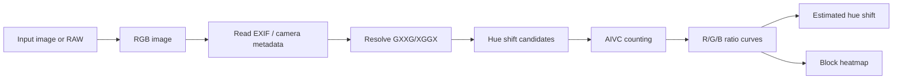
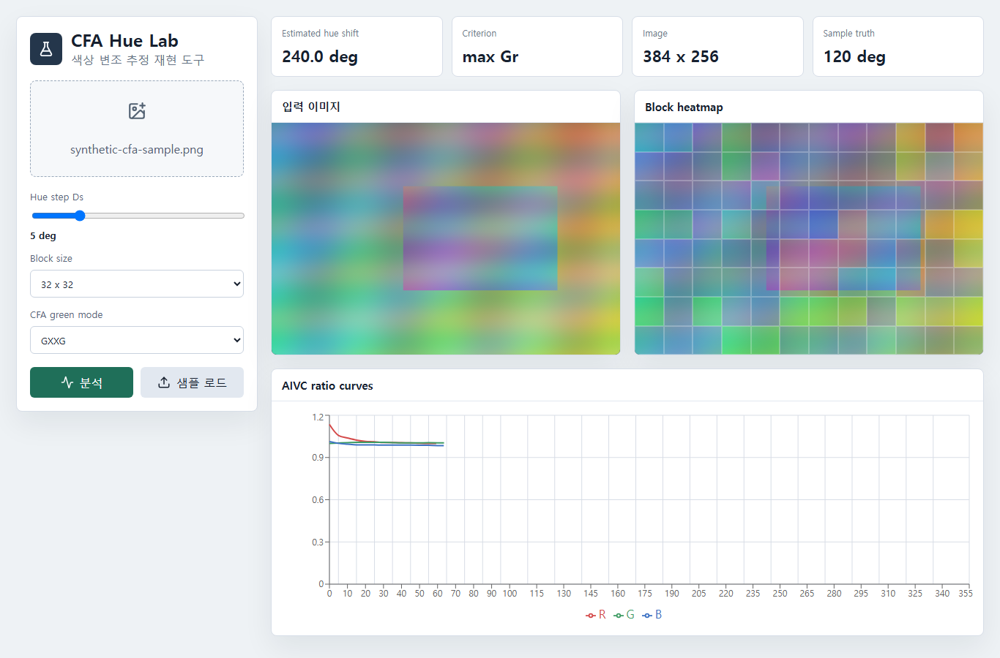

# CFA Hue Modification Lab

논문 **“Estimation of color modification in digital images by CFA pattern change”**의 핵심 알고리즘을 재현한 실험용 프로젝트입니다. 이미지의 CFA(Color Filter Array) 보간 흔적이 hue modification 이후 RGB 채널 사이에서 달라지는 현상을 AIVC(Advanced Intermediate Value Counting)로 추정합니다.

> Choi, C.-H., Lee, H.-Y., & Lee, H.-K. (2013). *Estimation of color modification in digital images by CFA pattern change*. Forensic Science International, 226(1-3), 94-105. DOI: [`10.1016/j.forsciint.2012.12.014`](https://doi.org/10.1016/j.forsciint.2012.12.014)


## 개요

이 저장소는 논문의 핵심 추정 절차를 실행 가능한 형태로 재현합니다.

- RGB/HSI 기반 hue shift 후보 탐색
- AIVC 기반 `Rr`, `Gr`, `Br` ratio curve 계산
- `GXXG` / `XGGX` green CFA mode 처리
- EXIF `Make` / `Model` 기반 카메라 CFA pattern lookup
- block 단위 hue modification heatmap
- FastAPI backend, React GUI, Python CLI
- Dresden JPG smoke test
- RAW 개발(development) ablation: `rawpy`/LibRaw 기반

논문 PDF와 외부 데이터셋은 저장소에 포함하지 않습니다.

## 재현 범위

| 항목 | 상태 |
| --- | --- |
| RGB/HSI hue shift | 구현 |
| AIVC counting | 구현 |
| `GXXG` / `XGGX` CFA mode | 구현 |
| EXIF camera metadata 읽기 | 구현 |
| 알려진 카메라 CFA spec lookup | 구현 |
| Auto CFA mode fallback | 구현 |
| Ratio curve visualization | 구현 |
| Block heatmap | 구현 |
| 한국어/영어 GUI 토글 | 구현 |
| 단일 이미지 CLI 분석 | 구현 |
| Dresden JPG smoke test | 구현 |
| RAW 개발 ablation (`rawpy`) | 구현 |
| Dresden JPG 전체 batch benchmark | 향후 작업 |
| JPEG quality sweep 논문 figure 재현 | 향후 작업 |
| `dcraw` executable backend | 선택 사항 |

## RAW와 dcraw에 대한 입장

Dresden 원 배포에는 문헌상 RAW, Lightroom processed RAW, DCRaw processed RAW subset이 언급됩니다. 하지만 현재 접근 가능한 Kaggle Dresden 배포본과 이 프로젝트에서 사용한 로컬 Dresden set은 JPG-only입니다.

따라서 기본 재현은 JPG 입력 기준으로 동작합니다. RAW가 확보된 경우에는 `dcraw` 대신 `rawpy`/LibRaw로 RAW를 RGB로 develop해서 ablation 실험을 수행합니다. `dcraw`는 과거 연구와의 비교를 위한 historical reference로 남기고, 호환성과 설치 편의성 때문에 현재 구현의 기본 backend로는 사용하지 않습니다.

## 알고리즘 요약

1. 입력 이미지를 RGB로 변환합니다.
2. EXIF `Make` / `Model` / `Software`를 읽습니다.
3. curated camera CFA table에서 Bayer pattern을 찾습니다.
4. 알려진 카메라면 Bayer pattern을 green CFA mode로 변환합니다.
   - `RGGB`, `BGGR` -> `XGGX`
   - `GBRG`, `GRBG` -> `GXXG`
5. 알려진 카메라가 아니면 이미지 자체의 AIVC parity 신호로 `GXXG` / `XGGX`를 추정합니다.
6. hue 후보를 `Ds` 간격으로 순회하며 각 후보 이미지의 AIVC count를 계산합니다.
7. `Rr`, `Gr`, `Br` ratio curve를 만들고, 논문 기준에 따라 hue modification을 추정합니다.
8. 같은 절차를 block 단위로 반복해 heatmap을 만듭니다.



카메라 CFA lookup 정책과 현재 등록된 spec은 [docs/CAMERA_CFA_PATTERNS.md](docs/CAMERA_CFA_PATTERNS.md)에 정리되어 있습니다.

## Demo



GUI는 분석 도구가 첫 화면입니다. 이미지 업로드, 합성 샘플 로드, `Ds`, block size, CFA mode 선택, 한/영 토글, 카메라/CFA 정보, ratio curve, block heatmap을 제공합니다.

## 설치

### Backend

```powershell
cd backend
python -m venv .venv
.venv\Scripts\Activate.ps1
pip install -r requirements.txt
python -m uvicorn app.main:app --reload --host 127.0.0.1 --port 8000
```

### Frontend

```powershell
cd frontend
npm install
npm run dev
```

브라우저에서 `http://127.0.0.1:5173`을 엽니다.

## CLI 사용법

단일 JPEG/PNG 이미지 분석:

```powershell
$env:PYTHONPATH="$PWD\backend"
python backend\scripts\analyze_image_cli.py path\to\image.jpg
```

전체 JSON 출력:

```powershell
$env:PYTHONPATH="$PWD\backend"
python backend\scripts\analyze_image_cli.py path\to\image.jpg --ds 5 --block-size 64 --json
```

주요 옵션:

- `--ds`: hue search step. 기본값 `10`
- `--block-size`: heatmap block size. 기본값 `128`
- `--max-side`: 분석 전 resize longest side. 기본값 `768`
- `--mode`: `AUTO`, `GXXG`, `XGGX`. 기본값 `AUTO`

## RAW Ablation

RAW 이미지가 있을 때는 `rawpy` backend로 develop한 RGB에 대해 같은 AIVC 분석을 실행할 수 있습니다.

```powershell
$env:PYTHONPATH="$PWD\backend"
python backend\scripts\raw_ablation_cli.py path\to\image.NEF --known-shift 120 --ds 10
```

JPEG 압축 품질별 degradation도 함께 볼 수 있습니다.

```powershell
$env:PYTHONPATH="$PWD\backend"
python backend\scripts\raw_ablation_cli.py path\to\image.NEF --known-shift 120 --jpeg-quality 95 85 70 50
```

이 스크립트는 다음을 출력합니다.

- RAW backend
- rawpy가 읽은 raw Bayer pattern과 green CFA mode
- baseline estimated hue
- known hue shift 적용 후 estimated hue
- baseline 대비 delta와 known shift 대비 error
- JPEG quality별 error

RAW ablation에서는 EXIF camera lookup보다 RAW 컨테이너에서 직접 읽은 `raw_pattern`을 우선합니다. 카메라 spec table과 RAW 파일 내부 pattern이 다르면 JSON 결과의 `raw_camera_cfa_conflict`로 표시합니다.

공개 테스트용 RAW 샘플은 raw.pixls.us에서 받을 수 있습니다. raw.pixls.us는 업로드자가 public domain/CC0로 공개한 RAW 샘플을 모아 LibRaw, darktable, RawTherapee regression testing 등에 사용하는 archive입니다.

## Dresden Smoke Test

Dresden Image Database처럼 카메라별 폴더에 JPG가 들어 있는 구조를 빠르게 점검할 수 있습니다. 원본 이미지는 forged image가 아니므로, 스크립트가 내부적으로 known hue shift를 적용한 복사본을 만들고 추정 오차를 확인합니다.

```powershell
$env:PYTHONPATH="$PWD\backend"
python backend\scripts\run_dresden_smoke.py <DATASET_ROOT> --per-camera 1 --max-side 384 --ds 30 --known-shift 120
```

출력 JSON에는 카메라 EXIF, Bayer pattern, green mode source, image estimate confidence, known shift 대비 오차가 포함됩니다.

## API

### `GET /api/health`

서버 상태를 확인합니다.

### `POST /api/analyze`

이미지를 분석합니다.

Form fields:

- `file`: PNG 또는 JPEG 이미지
- `ds`: hue search step. 기본값 `5`
- `block_size`: heatmap block size. 기본값 `32`
- `cfa_green_mode`: `AUTO`, `GXXG`, `XGGX`

응답에는 다음 데이터가 포함됩니다.

- `camera`: EXIF camera metadata, Bayer CFA lookup 결과
- `options`: 요청 옵션과 실제 resolved CFA mode
- `cfa_prediction`: 이미지 기반 CFA mode estimate와 confidence
- `estimate`: 전체 이미지 hue modification estimate
- `curves`: R/G/B AIVC ratio curves
- `heatmap`: block-level hue estimate 배열

### `POST /api/generate-sample`

저작권 부담 없는 합성 샘플 이미지를 생성합니다. 중앙 영역에 알려진 hue shift를 적용해 GUI와 integration test에 사용합니다.

## 한계

- 원본 Dresden JPG는 hue 변조된 forged image가 아닙니다. 원본에서 나온 estimated hue 값은 조작량으로 해석하면 안 됩니다.
- 신뢰할 수 있는 검증은 원본에 known hue shift를 적용한 후, 원본 estimate 대비 이동량을 비교하는 방식입니다.
- JPEG 고압축, resizing, rotation, crop은 CFA trace를 크게 약화시킬 수 있습니다.
- EXIF lookup table은 curated subset입니다. unknown camera는 이미지 기반 fallback을 사용합니다.
- RAW ablation은 RAW 파일이 확보된 경우에만 가능합니다. RAW 파일 자체는 저장소에 포함하지 않습니다.
- 이 구현은 연구/교육용 재현입니다. 법적 감정이나 증거 판단에 그대로 사용할 수 없습니다.

## 테스트

```powershell
cd backend
pytest
```

Frontend build:

```powershell
cd frontend
npm run build
```

## Repository Notes

- 논문 PDF와 외부 데이터셋은 저장소에 포함하지 않습니다.
- `local_raw_samples/`, `frontend/dist/`, `node_modules/`, Python cache는 commit 대상이 아닙니다.
- GitHub 공개 저장소명은 `cfa-hue-modification-lab`입니다.

## Citation

이 저장소를 논문 재현, 수업, 실험 자료로 사용할 때는 원 논문을 인용해 주세요.

```bibtex
@article{choi2013estimation,
  title = {Estimation of color modification in digital images by CFA pattern change},
  author = {Choi, Chang-Hee and Lee, Hae-Yeoun and Lee, Heung-Kyu},
  journal = {Forensic Science International},
  volume = {226},
  number = {1-3},
  pages = {94--105},
  year = {2013},
  publisher = {Elsevier},
  doi = {10.1016/j.forsciint.2012.12.014}
}
```

## License

MIT
