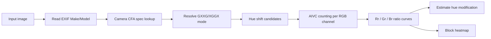

# CFA Hue Modification Lab

논문 **“Estimation of color modification in digital images by CFA pattern change”**의 핵심 아이디어를 재현한 실험용 프로젝트입니다. 디지털 카메라의 CFA(Color Filter Array) 보간 흔적이 색상 변조 후 RGB 채널 사이에서 이동한다는 관찰을 바탕으로, AIVC(Advanced Intermediate Value Counting) 방식으로 hue modification 정도를 추정합니다.

> Choi, C.-H., Lee, H.-Y., & Lee, H.-K. (2013). *Estimation of color modification in digital images by CFA pattern change*. Forensic Science International, 226(1-3), 94-105. DOI: `10.1016/j.forsciint.2012.12.014`


## 요약

색상 변조는 이미지 조작에서 흔하지만, 단순히 RGB 값이 바뀐 결과만 보면 조작 여부와 정도를 판단하기 어렵습니다. 이 논문은 디지털 카메라의 demosaicing 과정이 남기는 CFA 패턴 흔적이 hue 변조 후 RGB 채널 사이에서 이동한다는 점을 이용합니다.

이 저장소는 그 핵심 아이디어를 재현합니다. 사용자는 이미지를 업로드하고, AIVC ratio curve와 block heatmap을 통해 hue modification 추정 결과를 확인할 수 있습니다.

## Paper

- **Title:** Estimation of color modification in digital images by CFA pattern change
- **Authors:** Chang-Hee Choi, Hae-Yeoun Lee, Heung-Kyu Lee
- **Venue:** Forensic Science International, 226(1-3), 94-105, 2013
- **DOI:** [10.1016/j.forsciint.2012.12.014](https://doi.org/10.1016/j.forsciint.2012.12.014)

## Reproduction Status

| Item | Status |
| --- | --- |
| RGB/HSI hue shifting | Implemented |
| AIVC counting | Implemented |
| `GXXG` / `XGGX` green CFA mode handling | Implemented |
| Auto CFA green mode estimation with confidence | Implemented |
| Ratio curve visualization | Implemented |
| Block-level heatmap | Implemented |
| Synthetic demo sample | Implemented |
| Dresden JPG smoke test | Implemented |
| Full RAW/dcraw reproduction pipeline | Planned |
| JPEG quality sweep matching paper figures | Planned |

## 무엇을 재현했나

- RGB 이미지에서 hue 후보를 `Ds` 간격으로 순회합니다.
- 각 후보 이미지의 R/G/B 채널에 대해 cross-neighbor AIVC counting을 수행합니다.
- 2x2 CFA 위치별 count ratio인 `Rr`, `Gr`, `Br` curve를 계산합니다.
- `AUTO` 모드에서는 AIVC count parity로 `GXXG`/`XGGX` green CFA mode를 추정하고 confidence를 반환합니다.
- EXIF `Make`/`Model`을 읽어 알려진 카메라의 Bayer CFA pattern을 우선 표시합니다.
- `GXXG` 패턴은 `Gr` 최대 위치, `XGGX` 패턴은 `Gr` 최소 위치를 기준으로 hue shift를 추정합니다.
- 이미지를 block 단위로 나누어 변조 위치를 heatmap으로 시각화합니다.

이 저장소는 논문 전체 실험을 완전 복제하기보다, 논문의 핵심 추정 로직과 데모 가능한 분석 흐름을 재현하는 것을 목표로 합니다.

## Method Overview

1. 입력 이미지를 RGB로 정규화합니다.
2. EXIF `Make`/`Model`을 읽고 known camera CFA table에서 Bayer pattern을 찾습니다.
3. 스펙을 찾으면 full Bayer pattern을 green CFA mode로 변환하고, 없으면 image-based Auto CFA estimate를 사용합니다.
4. hue 후보를 `0..359` 범위에서 `Ds` 간격으로 이동합니다.
5. 각 hue 후보 이미지의 R/G/B 채널에서 AIVC count를 계산합니다.
6. 2x2 CFA parity별 count ratio를 이용해 `Rr`, `Gr`, `Br` curve를 만듭니다.
7. green CFA mode가 `GXXG`이면 `Gr` 최대 위치를, `XGGX`이면 `Gr` 최소 위치를 찾습니다.
8. 찾은 위치 `Hm`으로부터 `He = (360 - Hm) mod 360`을 계산합니다.
9. block 단위로 같은 과정을 반복해 변조 위치를 heatmap으로 표시합니다.



## 데모 화면


## 프로젝트 구성

```text
backend/
  app/main.py                 FastAPI 엔드포인트
  app/core/hue.py             HSI hue shift, AIVC, CFA mode 예측, curve/heatmap 분석
  scripts/run_dresden_smoke.py Dresden JPG 스모크 테스트
  tests/                      알고리즘 및 API 테스트
frontend/
  src/main.tsx                React 분석 도구 화면
  src/styles.css              연구 도구형 UI 스타일
docs/screenshots/             데모 화면 캡처
```

카메라별 CFA pattern lookup 정책과 현재 curated table은 [docs/CAMERA_CFA_PATTERNS.md](docs/CAMERA_CFA_PATTERNS.md)에 정리되어 있습니다.

## 실행 방법

### 1. 백엔드 설치 및 실행

```powershell
cd backend
python -m venv .venv
.venv\Scripts\Activate.ps1
pip install -r requirements.txt
python -m uvicorn app.main:app --reload --host 127.0.0.1 --port 8000
```

### 2. 프론트엔드 설치 및 실행

새 터미널에서:

```powershell
cd frontend
npm install
npm run dev
```

pnpm을 선호한다면:

```powershell
cd frontend
pnpm install
pnpm run dev
```

브라우저에서 `http://127.0.0.1:5173`을 열면 됩니다.

### 3. 테스트

```powershell
cd backend
pytest
```

프론트엔드 production build:

```powershell
cd frontend
npm run build
```

## Dresden 데이터셋 스모크 테스트

Dresden Image Database처럼 카메라별 폴더 아래 JPG 파일이 들어 있는 구조를 빠르게 확인할 수 있습니다. 원본 이미지를 직접 변조된 이미지로 해석하지 않고, 코드 안에서 known hue shift를 적용한 복사본을 만든 뒤 추정값 변화량을 비교합니다.

```powershell
$env:PYTHONPATH="$PWD\backend"
python backend\scripts\run_dresden_smoke.py <DATASET_ROOT> --per-camera 1 --max-side 384 --ds 30 --known-shift 120
```

예: `<DATASET_ROOT>`에는 `Z:\Dresden_Exp`처럼 Dresden JPG 폴더가 들어 있는 경로를 넣습니다.

최근 스모크 테스트에서는 카메라별 1장씩 13장을 골라 `+120 deg` hue shift를 적용했고, `Ds=30` 기준 모든 샘플이 한 step 이내 오차로 들어왔습니다. 이 수치는 빠른 sanity check이며, 논문 전체 실험 결과를 대체하지 않습니다.

## API

### `GET /api/health`

서버 상태를 확인합니다.

### `POST /api/analyze`

이미지를 분석합니다.

Form fields:

- `file`: PNG 또는 JPEG 이미지
- `ds`: hue 탐색 간격, 기본값 `5`
- `block_size`: heatmap block 크기, 기본값 `32`
- `cfa_green_mode`: `AUTO`, `GXXG`, 또는 `XGGX`

응답에는 EXIF camera metadata, known Bayer pattern lookup 결과, 자동 CFA green mode 예측값과 confidence, 전체 추정 hue, R/G/B ratio curve, block heatmap 배열이 포함됩니다.

### `POST /api/generate-sample`

저작권 부담 없는 합성 샘플을 생성합니다. 중앙 영역에 알려진 hue shift를 적용해 데모와 테스트에 사용합니다.

## 해석할 때 주의할 점

- 원본 Dresden JPG는 hue 변조된 forged 이미지가 아닙니다.
- 원본의 절대 estimated hue 값은 “변조량”으로 직접 해석하면 안 됩니다.
- 더 안정적인 검증은 원본에 known hue shift를 적용한 복사본을 만들고, 원본 추정값 대비 이동량을 확인하는 방식입니다.
- JPEG 품질이 낮거나, resizing/rotation이 강하게 적용된 이미지는 CFA trace가 손상되어 추정 성능이 떨어질 수 있습니다.
- `AUTO` CFA mode 예측은 JPEG 압축이 강한 이미지에서 confidence가 낮게 나올 수 있으므로 `GXXG`/`XGGX` 수동 선택과 함께 해석해야 합니다.
- 이 구현은 연구 재현과 교육용 데모입니다. 법적 감정이나 증거 판단에 바로 사용할 수 없습니다.

## 향후 작업

- Dresden dataset 준비 스크립트와 dcraw 기반 full reproduction pipeline 추가
- JPEG quality sweep 실험 및 논문 Fig. 16/17 유사 그래프 재현
- CFA green mode 자동 추정 정확도 개선
- 회전, resize, crop이 섞인 변조에 대한 견고성 개선

## Citation

이 저장소를 논문 재현, 수업, 실험 자료로 사용할 때는 원 논문을 인용해 주세요.

```bibtex
@article{choi2013estimation,
  title = {Estimation of color modification in digital images by CFA pattern change},
  author = {Choi, Chang-Hee and Lee, Hae-Yeoun and Lee, Heung-Kyu},
  journal = {Forensic Science International},
  volume = {226},
  number = {1-3},
  pages = {94--105},
  year = {2013},
  publisher = {Elsevier},
  doi = {10.1016/j.forsciint.2012.12.014}
}
```

## License

MIT
